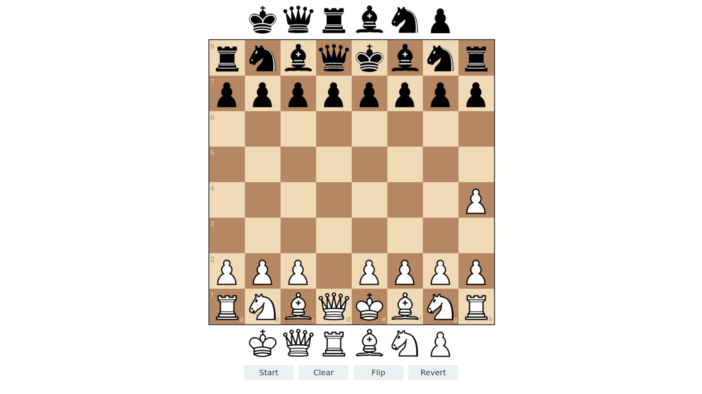

# Chessboard Editor

A simple chessboard editor that functions entirely without the Internet. The application runs smoothly on computers, mobile phones, and iPads.

Click [here](https://RayChien01.github.io/chessboard-editor/) to launch the online Github page. Of course, it is also available to download all the files and open index.html to use without the Internet. The background colour changes with the system theme. 

[Chessboard.js](https://chessboardjs.com/) is created by Chris Oakman released under the MIT license.
[jQuery](https://jquery.com/) is created by the OpenJS Foundation released under the MIT license.
